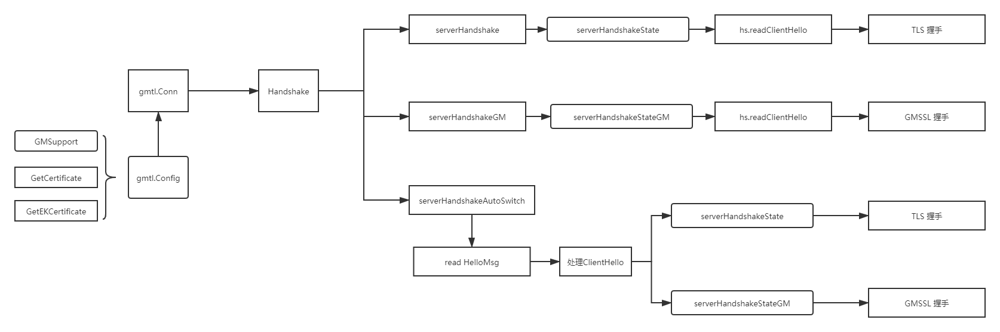

# TLS/GMSSL Web 服务器

目录结构说明:

```
├─certs        // 证书以及密钥
├─cli          // HTTP客户端Demo
│  ├─gm        // HTTP over GMSSL GET Demo
│  └─std       // HTTP over TLS GET Demo
└─svr          // HTTP服务端Demo
```

## 服务端 GMTLS/TLS 工作逻辑




通过配置`gmtls.Config` 对象提供自动切换相关的配置，创建`gmtls.Conn`。

在对`gmtls.Conn`的`Read/Wirte`时将会触发握手行为`HandShake`。

`HandShake`会根据用户配置参数，判断需要使用 GMSSL、TLS、GMSSL/TLS 三种工作模式中的哪一种，
然后进入到相应的工作模式中运行。

- **TLS工作模式**:
    - 运行`serverHandshake` 进入TLS握手。
    - 创建TLS握手上下文`serverHandshakeState`。
    - 读取并处理 来自于客户端的ClientHello 消息。
    - 进入 TLS握手流程。
- **GMSSL工作模式**:
    - 运行`serverHandshakeGM` 进入GMSSL握手。
    - 创建TLS握手上下文`serverHandshakeStateGM`。
    - 读取并处理 来自于客户端的ClientHello 消息。
    - 进入 GMSSL握手流程。
- **GMSSL/TLS工作模式**:
    - 运行`serverHandshakeAutoSwitch` 进入自动切换的握手模式。
    - 读取来自于客户端的ClientHello 消息。
    - 分析处理ClientHello，根据客户端协议版本。
    - 根据协议版本，选择使用具体握手方式：
      - GMSSL: 创建上下文`serverHandshakeStateGM`，进入GMSSL握手流程。
      - TLS: 创建上下文`serverHandshakeState`，进入TLS握手流程。

